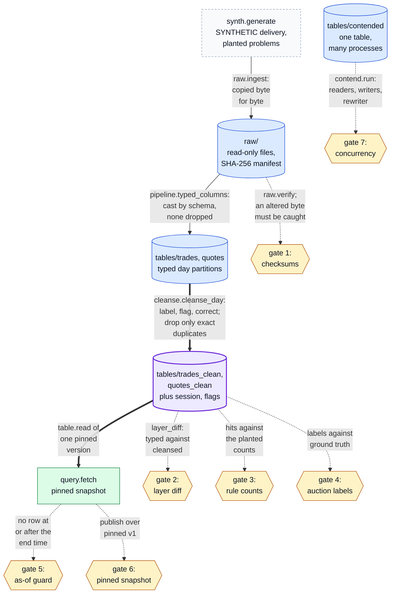
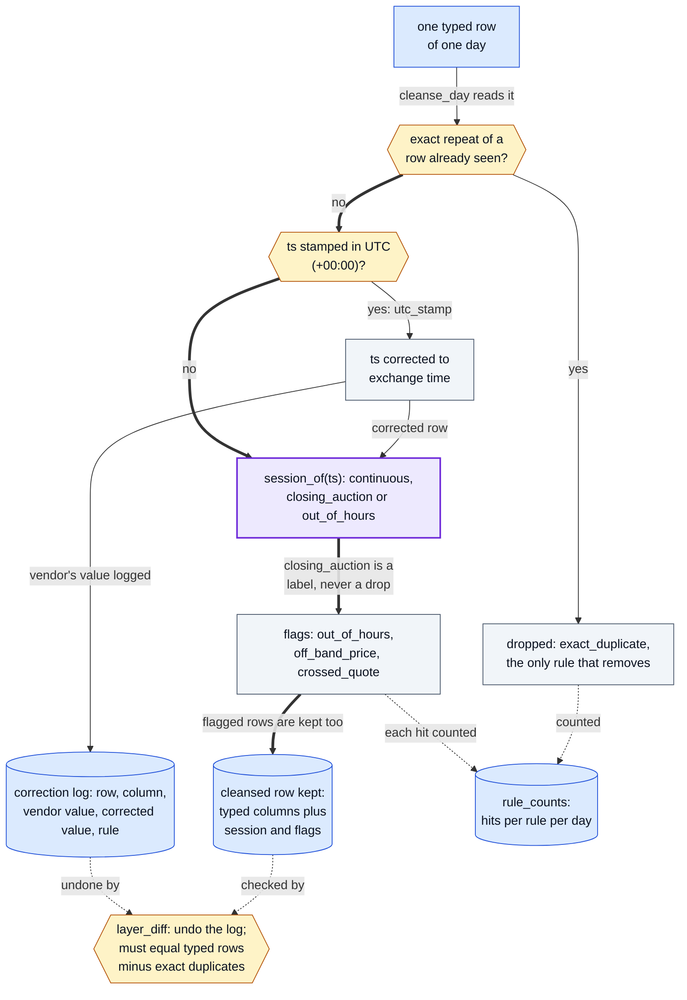

# minilake: a runnable stand-in for a research market-data platform

[](https://github.com/oscar-chw/qts-platform-demo/actions/workflows/ci.yml) [](https://github.com/oscar-chw/qts-platform-demo/actions/workflows/lint.yml)

**minilake** is a small, runnable stand-in for a research market-data platform: a raw, a typed and
a cleansed layer, versioned tables with pinned reads, and one query function, in the standard
library only. It is for readers of the [qts-platform-showcase](https://github.com/oscar-chw/qts-platform-showcase)
write-up who want to run its ideas; it was written only from that write-up and shares no code with
the platform. On SYNTHETIC data, all seven gates pass, each with a control in the same run:
delivered files stay untouched, cleansing changes only what its rules name, a pinned read returns
the same rows later, no query sees the future and concurrent writers lose no commits.

The layers a SYNTHETIC delivery passes through, built by `pipeline.build`, and the seven gates that
check them, run in order by `gates.run`:



Where in the code: [synth.py](minilake/synth.py), [raw.py](minilake/raw.py), [pipeline.py](minilake/pipeline.py),
[cleanse.py](minilake/cleanse.py), [table.py](minilake/table.py), [query.py](minilake/query.py), [contend.py](minilake/contend.py),
[gates.py](minilake/gates.py).

## Why this exists

Researchers who study markets at tick level need three things raw vendor files cannot give them:
data they can trust, queries that answer quickly, and results they can reproduce next month on
exactly the same rows. The platform the showcase describes keeps those guarantees, but its source
is closed; minilake puts the same guarantees into code anyone can run and break.

## Approach

[minilake/synth.py](minilake/synth.py) generates a small SYNTHETIC tick delivery with planted
problems: exact duplicates, an evening print, a price far off the previous trade, a crossed quote,
trades stamped in UTC instead of exchange time, closing-auction trades, and a missing day. Then:

- **raw** keeps the delivered files byte for byte and read-only under a SHA-256 manifest;
  verification reports any altered byte, and different bytes under a name already held are refused.
- **typed** stores column-oriented day partitions under a schema, with nothing corrected and
  nothing dropped. Every publish is a new version folder with its manifest, made visible by one
  atomic rename (optimistic concurrency in the style of Delta Lake and Apache Iceberg), and readers
  pin a version. A replace that a concurrent commit has overtaken raises a conflict instead of
  discarding that commit.
- **cleansed** labels, flags or corrects and drops only exact duplicates. Each rule's hits are
  counted per day, and every corrected cell goes into a correction log with the vendor's value.
  The write-up records why: a time-window filter had silently discarded a day's closing-auction
  trades ([showcase](https://github.com/oscar-chw/qts-platform-showcase#results)).
- **query** is `fetch(lake, table, universe, from_, to, freq=..., snapshot=..., gaps=...)`, with
  partition pruning and explicit errors (`MissingDay`, `NoSuchInstrument`, `LookAhead`). The read
  path hands over whole days, and an as-of guard withholds every row from `to` on;
  `gaps="carry_back"` looks only backwards, and `gaps="closest"` needs `permit_future=True`.
- **seven gates** check every guarantee, each with a control in the same run: a planted defect it
  must catch, or the generator's ground truth it must match ([docs/gates.md](docs/gates.md)).

What cleansing does to each typed row: one rule removes, the others label, flag or correct, and the
layer diff holds the result to what the rules name.



Where in the code: `cleanse_day` and `layer_diff` in [cleanse.py](minilake/cleanse.py).

### Design decisions and trade-offs

- **Standard library only.** JSON column files stand in for a columnar file format, so the demo
  runs anywhere with nothing to install, and the platform's own stack is deliberately not used.
  The cost is speed: nothing here is fast, and no timing is reported.
- **Flag, never drop.** A correction keeps the vendor's value in the log, so the layer diff can
  prove that cleansing changed only what the rules name.
- **Publish by atomic rename.** A version becomes visible all at once or not at all.
- **Errors over empty results.** A missing day, an unknown symbol or a look-ahead fill raises;
  `on_missing="skip"` must be asked for, and it names the days it skipped.
- **A control in every gate**, and the concurrency gate's processes run under a deadline, so a
  silent gate cannot pass for a healthy one.

## Results

SYNTHETIC data. The gates section of `python3 -m minilake`, run on 2026-10-05 with Python 3.9.6,
verbatim:

```text
gates      each runs a positive control: a planted defect to catch, or ground truth to match
  PASS  checksums        8 raw files verified, 0 problems; controls: altered raw byte caught: True; altered table byte refused by fetch: True
  PASS  layer diff       8 table-days diffed, 0 unexplained changes; controls caught: unnamed value change, unlogged time change, wrong session label
  PASS  rule counts      found/planted: exact_duplicate 3/3, out_of_hours 1/1, off_band_price 1/1, crossed_quote 1/1, utc_stamp 4/4, closing_auction 12/12, missing_day 1/1
  PASS  auction labels   12 labelled closing_auction; ground truth 12 kept of 12 delivered; same rows: True; flagged: 0
  PASS  as-of guard      271 rows returned, last 2024-03-05T09:59:25.651 < 2024-03-05T10:00; control: the read path handed over 214 later rows and the guard withheld them; open bar withheld: True; 27 carry_back fills, each equal to the earlier bar it names: True; gaps='closest' without permit_future refused: True
  PASS  pinned snapshot  v2 published over the pinned v1; fetch(snapshot=1) unchanged: True (122 rows); control: latest differs: True (31 rows)
  PASS  concurrency      4 readers, 2 writers, 1 rewriter: commits 40/40 acknowledged, lost 0; rewrites 60 (conflicts retried 5); reads 915, torn 0; crashed 0, hung 0; pinned version unchanged: True; controls: torn read caught: True, stale replace refused: True
  gates: 7/7 pass
```

The synthetic delivery is seeded, so every figure above repeats exactly on the next run except the
concurrency line's rewrite, conflict and read counts, which depend on how the processes interleave.
`scripts/check_docs.py` re-runs the demo and fails if this block differs from its output in
anything but those three counts. The walkthrough above the gates (per-rule hits per day, the
correction log, bars and the errors `fetch` raises) is printed by the same command. What each gate
checks and its control: [docs/gates.md](docs/gates.md).

## Quick start

```bash
bash scripts/demo.sh                      # every layer, then the gates; exit 0 only if all pass
python3 -m unittest discover -s tests     # one test class per layer, plus the gates
bash scripts/check.sh                     # the document checks and their self-test, the tests, the demo
```

Python 3.9 or later, standard library only; nothing to install. CI runs `scripts/check.sh` on
Python 3.9 and 3.12 ([ci.yml](.github/workflows/ci.yml)).

## Project structure

```text
minilake/synth.py      the SYNTHETIC delivery and the counts of what it plants
minilake/raw.py        layer 1: delivered files, read-only, under a SHA-256 manifest
minilake/table.py      versioned typed tables: atomic publish, pinned reads, conflict on a stale replace
minilake/pipeline.py   builds the typed and cleansed layers from the raw layer
minilake/cleanse.py    the cleansing rules, their per-day counts and correction log, the layer diff
minilake/query.py      fetch(): pinned snapshots, partition pruning, bars and the as-of guard
minilake/contend.py    concurrent reader, writer and rewriter processes on one table
minilake/gates.py      every invariant as a check; exit 0 only if all hold
minilake/__main__.py   the walkthrough, then the gates
tests/  scripts/       one test class per layer; demo.sh, check.sh, check_docs.py
```

Docs: see [docs/README.md](docs/README.md).

## Limits

- **Toy scale.** Five calendar days, four of them delivered, three symbols, and 1,456 trade rows
  plus 1,440 quote rows in the typed layer (printed by `python3 -m minilake`). Nothing here
  measures speed or capacity.
- **SYNTHETIC data.** The gates find the problems [synth.py](minilake/synth.py) plants; real
  vendor deliveries have quirks this generator does not model. None of it is market data.
- **Not the platform.** It shares no code with the platform and runs none of its stack; its
  numbers say nothing about the platform's scale or speed. The platform's own figures, labelled
  and sourced, are in [qts-platform-showcase](https://github.com/oscar-chw/qts-platform-showcase).
- **One machine.** The concurrency gate runs processes on one local file system and relies on its
  atomic rename; it says nothing about object stores or network file systems.

## What I learned

These are lessons the platform write-up records
([showcase, "What I learned"](https://github.com/oscar-chw/qts-platform-showcase#what-i-learned)),
the ones that concern the ideas this stand-in puts into code. It records no new ones.

1. **The worst failures pass for health**: a check that passes against a stand-in for the thing it
   should be checking, a health check that answers OK without asking the service it describes, and
   an alerter that is quiet because it has stopped. Here every gate runs its control in the same
   run, so a gate that has stopped looking fails.
2. **A probe that runs out of time produces the same empty output as a broken system**, so how
   long the probe takes has to be known before its silence means anything. Here the concurrency
   gate's processes run under a deadline, and a hang is reported as a hang.
3. **An unreliable checker does more harm than none, because its verdict gets trusted.** Hence
   checkers that carry self-tests and gates that refuse an empty run: here an empty raw layer fails
   verification, and `scripts/check_docs.py --self-test` proves each document check goes red on a
   planted defect.

## Credits and licence

Written only from the public write-up of the CUHK Quant Trading Society's research data platform,
[qts-platform-showcase](https://github.com/oscar-chw/qts-platform-showcase), which describes the
real platform and carries its numbers. This is not the platform's code; the platform's source is
closed. MIT, in [LICENSE](LICENSE).

Implemented with AI coding agents under Oscar's design and review.
