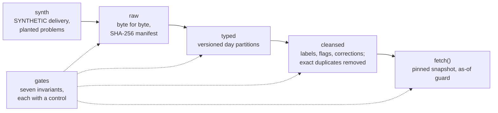

# qts-platform-demo: minilake

[](https://github.com/hihihhi/qts-platform-demo/actions/workflows/ci.yml) [](https://github.com/hihihhi/qts-platform-demo/actions/workflows/lint.yml)

**minilake** is a small, runnable stand-in for a research market-data platform: a raw, a typed and
a cleansed layer, versioned tables with pinned reads, one query function, and seven gates that each
prove an invariant, with a control, on every run. Standard library only; the demo runs in seconds.

- It was written only from the public write-up of the CUHK Quant Trading Society's research data
  platform: [qts-platform-showcase](https://github.com/hihihhi/qts-platform-showcase). That
  write-up describes the real platform and carries its numbers.
- It is not the platform's code and shares none of it. The platform's source is closed.
- Every number in this repository comes from SYNTHETIC data that [minilake/synth.py](minilake/synth.py)
  generates. None of it is market data, and none of it says anything about the platform's scale or speed.

Implemented with AI coding agents under Oscar's design and review.

```bash
bash scripts/demo.sh    # every layer on SYNTHETIC data, then the seven gates; exit 0 only if all pass
```

## The problem

Researchers who study markets at tick level need three things raw vendor files cannot give them:
data they can trust, queries that answer quickly, and results they can reproduce next month on
exactly the same rows. Turned into guarantees a research data platform has to keep:

- **Delivered files are never altered**, so every later layer can be rebuilt from them and any
  changed byte is detected.
- **Cleansing changes only what its rules name.** It labels, flags or corrects, keeps the vendor's
  original value, and removes nothing but exact duplicates. The write-up records why: a time-window
  filter had silently discarded a day's closing-auction trades
  ([showcase](https://github.com/hihihhi/qts-platform-showcase#architecture)).
- **A result can be reproduced on the same rows**: readers pin a version, and a later publish never
  changes what a pinned read returns.
- **A query never sees the future**: nothing at or after its end time is returned, and gap fills
  that would copy a later value need an explicit opt-in.
- **Asking for something that is not there raises an error** instead of returning an empty or
  silently partial table.
- **Concurrent writers never lose a commit, and readers never see a half-written version.**

## Approach (methods and algorithms)

[minilake/synth.py](minilake/synth.py) generates a small SYNTHETIC tick delivery with planted
problems: exact duplicates, an evening print, a price far off the previous trade, a crossed quote,
trades stamped in UTC instead of exchange time, closing-auction trades, and a missing day. Then:

- **raw** keeps the delivered files byte for byte and read-only under a SHA-256 manifest;
  verification reports any altered byte, and different bytes under a name already held are refused.
- **typed** stores column-oriented day partitions under a schema, with nothing corrected and
  nothing dropped. Every publish is a new version folder with its manifest, made visible by one
  atomic rename (optimistic concurrency in the style of Delta Lake and Apache Iceberg), and readers
  pin a version. A replace that a concurrent commit has overtaken raises a conflict instead of
  discarding that commit.
- **cleansed** labels, flags or corrects and drops only exact duplicates. Each rule's hits are
  counted per day, and every corrected cell goes into a correction log with the vendor's value.
- **query** is `fetch(lake, table, universe, from_, to, freq=..., snapshot=..., gaps=...)`, with
  partition pruning and explicit errors (`MissingDay`, `NoSuchInstrument`, `LookAhead`). The read
  path hands over whole days, and an as-of guard withholds every row from `to` on;
  `gaps="carry_back"` looks only backwards, and `gaps="closest"` needs `permit_future=True`.

The seven gates ([minilake/gates.py](minilake/gates.py)). A gate that looks for a defect proves
nothing by staying quiet, so each runs a control in the same run: a planted defect it must catch,
or the synthetic ground truth it must match.

| Gate | Invariant | Control in the same run |
|---|---|---|
| checksums | every raw file matches its manifest | one altered byte in a raw file is reported; one in a table file makes `fetch` refuse the read |
| layer diff | undo the logged corrections and the cleansed rows equal the typed rows minus exact duplicates | an unnamed value change, an unlogged time change and a wrong session label are each caught |
| rule counts | each planted problem is found exactly as often as it was planted | the planted counts themselves |
| auction labels | every closing-auction trade, and only those, is labelled, kept and unflagged | the generator's ground truth |
| as-of guard | no row at or after `to`; an open bar is withheld; carry-back fills only copy earlier bars | the read path hands over later rows, and the guard must withhold them; `gaps="closest"` must be refused |
| pinned snapshot | a publish over a pinned version leaves the pinned read unchanged | the latest version must differ |
| concurrency | reader, writer and rewriter processes: every commit acknowledged, none lost, no torn read | a planted torn read is caught; a stale replace is refused |

Reader, writer and rewriter processes run under a deadline, so a crash or a hang fails the gate.

## Results

SYNTHETIC data. The gates section of `python3 -m minilake`, run on 2026-10-05 with Python 3.9.6,
verbatim:

```text
gates      each runs a positive control: a planted defect to catch, or ground truth to match
  PASS  checksums        8 raw files verified, 0 problems; controls: altered raw byte caught: True; altered table byte refused by fetch: True
  PASS  layer diff       8 table-days diffed, 0 unexplained changes; controls caught: unnamed value change, unlogged time change, wrong session label
  PASS  rule counts      found/planted: exact_duplicate 3/3, out_of_hours 1/1, off_band_price 1/1, crossed_quote 1/1, utc_stamp 4/4, closing_auction 12/12, missing_day 1/1
  PASS  auction labels   12 labelled closing_auction; ground truth 12 kept of 12 delivered; same rows: True; flagged: 0
  PASS  as-of guard      271 rows returned, last 2024-03-05T09:59:25.651 < 2024-03-05T10:00; control: the read path handed over 214 later rows and the guard withheld them; open bar withheld: True; 27 carry_back fills, each equal to the earlier bar it names: True; gaps='closest' without permit_future refused: True
  PASS  pinned snapshot  v2 published over the pinned v1; fetch(snapshot=1) unchanged: True (122 rows); control: latest differs: True (31 rows)
  PASS  concurrency      4 readers, 2 writers, 1 rewriter: commits 40/40 acknowledged, lost 0; rewrites 60 (conflicts retried 5); reads 915, torn 0; crashed 0, hung 0; pinned version unchanged: True; controls: torn read caught: True, stale replace refused: True
  gates: 7/7 pass
```

The synthetic delivery is seeded, so every figure above repeats exactly on the next run except the
concurrency line's rewrite, conflict and read counts, which depend on how the processes interleave.
`scripts/check_docs.py` re-runs the demo and fails if this block differs from its output in
anything but those three counts. The walkthrough above the gates (per-rule hits per day, the
correction log, bars and the errors `fetch` raises) is printed by the same command.

## How to run

Python 3.9 or later, standard library only; nothing to install. From the top of the repository:

```bash
bash scripts/demo.sh                      # every layer, then the gates; exit 0 only if all pass
python3 -m unittest discover -s tests     # one test class per layer, plus the gates
bash scripts/check.sh                     # the document checks and their self-test, the tests, the demo
```

CI runs `scripts/check.sh` on Python 3.9 and 3.12 ([.github/workflows/ci.yml](.github/workflows/ci.yml)).

## Architecture



| Module | Role |
|---|---|
| [synth.py](minilake/synth.py) | the SYNTHETIC delivery and the counts of what it plants |
| [raw.py](minilake/raw.py) | layer 1: delivered files, read-only, under a SHA-256 manifest |
| [table.py](minilake/table.py) | versioned, typed, column-oriented tables: atomic publish, pinned reads, conflict on a stale replace |
| [pipeline.py](minilake/pipeline.py) | builds the typed and cleansed layers from the raw layer |
| [cleanse.py](minilake/cleanse.py) | the cleansing rules, their per-day counts and correction log, and the layer diff |
| [query.py](minilake/query.py) | `fetch()`: pinned snapshots, partition pruning, bars and the as-of guard |
| [contend.py](minilake/contend.py) | concurrent reader, writer and rewriter processes on one table |
| [gates.py](minilake/gates.py) | every invariant as a check; exit 0 only if all hold |
| [\_\_main\_\_.py](minilake/__main__.py) | the walkthrough, then the gates |

### Design decisions and trade-offs

- **Standard library only.** JSON column files stand in for a columnar file format, so the demo
  runs anywhere with nothing to install. The platform's own stack is deliberately not used, which
  also keeps this stand-in clearly separate from it. The cost is speed: nothing here is fast, and
  no timing is reported.
- **Flag, never drop.** Only exact duplicates are removed. Every other rule labels, flags or
  corrects, and a correction keeps the vendor's value in the log, so the layer diff can prove that
  cleansing changed only what the rules name.
- **Publish by atomic rename.** A version becomes visible all at once or not at all, and a replace
  computed from an outdated version raises a conflict to retry rather than silently discarding a
  concurrent commit.
- **Errors over empty results.** A missing day, an unknown symbol or a look-ahead fill raises;
  `on_missing="skip"` must be asked for, and it names the days it skipped.
- **A control in every gate.** Each gate must catch a planted defect or match the generator's
  ground truth in the same run, and the concurrency gate's processes run under a deadline, so a
  silent gate cannot pass for a healthy one.

## Limits

- **Toy scale.** Five calendar days, four of them delivered, three symbols, and 1,456 trade rows
  plus 1,440 quote rows in the typed layer (printed by `python3 -m minilake`). Nothing here
  measures speed or capacity.
- **SYNTHETIC data.** The gates find the problems [synth.py](minilake/synth.py) plants; real
  vendor deliveries have quirks this generator does not model.
- **Not the platform.** It shares no code with the platform and runs none of its stack; its
  numbers say nothing about the platform. The platform's own figures, labelled and sourced, are in
  [qts-platform-showcase](https://github.com/hihihhi/qts-platform-showcase).
- **One machine.** The concurrency gate runs processes on one local file system and relies on its
  atomic rename; it says nothing about object stores or network file systems.

## What I learned

These are lessons the platform write-up records
([showcase, "What I learned"](https://github.com/hihihhi/qts-platform-showcase#what-i-learned)),
the ones that concern the ideas this stand-in puts into code. It records no new ones.

1. **The worst failures pass for health**: a check that passes against a stand-in for the thing it
   should be checking, a health check that answers OK without asking the service it describes, and
   an alerter that is quiet because it has stopped. Here every gate runs its control in the same
   run, so a gate that has stopped looking fails.
2. **A probe that runs out of time produces the same empty output as a broken system**, so how
   long the probe takes has to be known before its silence means anything. Here the concurrency
   gate's processes run under a deadline, and a hang is reported as a hang.
3. **An unreliable checker does more harm than none, because its verdict gets trusted.** Hence
   checkers that carry self-tests and gates that refuse an empty run: here an empty raw layer fails
   verification, and `scripts/check_docs.py --self-test` proves each document check goes red on a
   planted defect.

## Licence

MIT, in [LICENSE](LICENSE).
