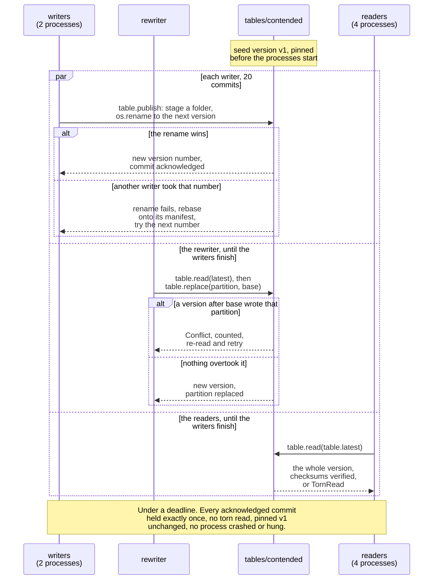

# What does each gate check, and what is its control?

The seven gates in [minilake/gates.py](../minilake/gates.py), run in order by `gates.run`. A gate
that looks for a defect proves nothing by staying quiet, so each runs a control in the same run: a
planted defect it must catch, or the synthetic ground truth it must match. Every figure they check
comes from SYNTHETIC data that [minilake/synth.py](../minilake/synth.py) generates.

| Gate | Invariant | Control in the same run |
|---|---|---|
| checksums | every raw file matches its manifest | one altered byte in a raw file is reported; one in a table file makes `fetch` refuse the read |
| layer diff | undo the logged corrections and the cleansed rows equal the typed rows minus exact duplicates | an unnamed value change, an unlogged time change and a wrong session label are each caught |
| rule counts | each planted problem is found exactly as often as it was planted | the planted counts themselves |
| auction labels | every closing-auction trade, and only those, is labelled, kept and unflagged | the generator's ground truth |
| as-of guard | no row at or after `to`; an open bar is withheld; carry-back fills only copy earlier bars | the read path hands over later rows, and the guard must withhold them; `gaps="closest"` must be refused |
| pinned snapshot | a publish over a pinned version leaves the pinned read unchanged | the latest version must differ |
| concurrency | reader, writer and rewriter processes: every commit acknowledged, none lost, no torn read | a planted torn read is caught; a stale replace is refused |

Reader, writer and rewriter processes run under a deadline, so a crash or a hang fails the gate.
The concurrency gate, as one run of it unfolds: writers commit by atomic rename and retry on the
next number, the rewriter's stale replace is refused and retried, and readers only ever see whole
versions.

Where in the code: `run` in [contend.py](../minilake/contend.py); `publish`, `replace` and `read` in
[table.py](../minilake/table.py).

What one run prints, and how the README's copy of it is checked: [README, Results](../README.md#results).
